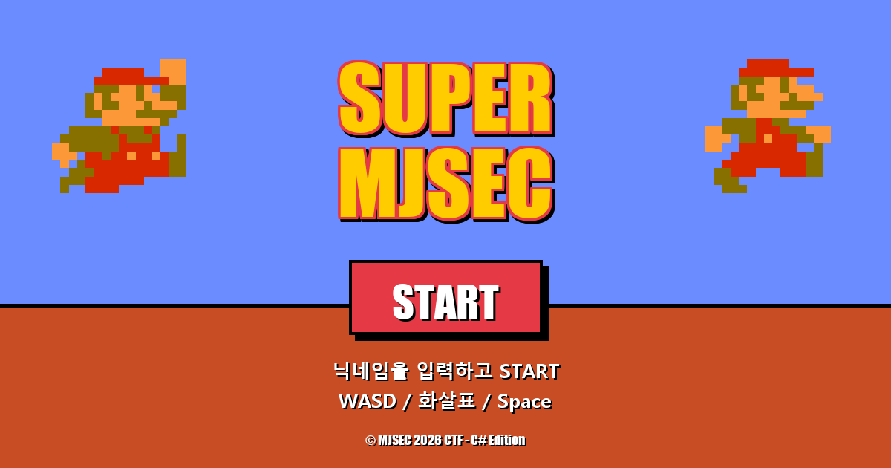

# Super MJSEC — The Rage Game 🐱

> 마리오풍 빡침 플랫포머를 가장한 **웹 해킹 CTF 챌린지**.
> Phaser.js 프론트엔드 + ASP.NET Core 백엔드 풀스택 프로젝트.



---

## 🎮 게임 소개

플레이어는 시보냥 스타일의 9000px 횡스크롤 플랫포머 맵을 클리어해야 합니다.
하지만 **의도적으로 불합리한 트랩 다수**로 인해 피지컬 풀이는 거의 불가능합니다.

**의도된 풀이는 게임 클리어가 아니라 웹 해킹입니다.**

```
[ 피지컬 풀이 ] : 무수한 빡침 트랩으로 1~2시간 좌절
[ 의도 풀이   ] : 쿠키 변조 → SSTI 익스플로잇 → HMAC 위조 → 골 좌표 직접 호출 (30분)
```

---

## ✨ 주요 기능

### 게임 메커닉
- **Phaser.js 3.x** 횡스크롤 플랫포머
- 6종 트랩: 굼바, 거북이, 미친 굼바, Bullet Bill 대포, 운석, 사라지는 바닥, ?블록 함정
- 좌우 패트롤 AI, 발사체 시스템, 페이드 애니메이션
- 카메라 동적 zoom, parallax 배경

### CTF 챌린지 설계
- **3단계 vuln 체이닝**: 쿠키 변조 + SSTI(Scriban) + HMAC 위조
- **안티봇 게이트**: 30초 게이트, 사망/이동/점프 패턴 검증, 트랩 다양성 요구
- **LLM 1샷 풀이 차단**: 행동 시뮬레이션을 강제하여 코드만 분석하는 풀이 무력화

### 풀스택 구현
- **백엔드**: ASP.NET Core 8 Minimal API, Scriban 템플릿 엔진, HMAC-SHA256
- **프론트엔드**: Vanilla JS + Phaser.js, 시작화면 UI, 죽음 화면 진행도 시각화
- **세션 관리**: ASP.NET 분산 메모리 캐시, 쿠키 기반 권한 분리
- **배포**: Docker + docker-compose, Cloudflare Tunnel 기반 외부 노출

---

## 🛠 기술 스택

| 영역 | 기술 |
|---|---|
| 게임 엔진 | Phaser.js 3.70 |
| 백엔드 | ASP.NET Core 8, C# |
| 템플릿 엔진 | Scriban |
| 빌드 | .NET SDK, Docker |
| 배포 | Cloudflare Tunnel / Oracle Cloud |

---

## 🚀 실행 방법

### 로컬 실행 (.NET SDK 필요)
```bash
cd challenge
dotnet restore
dotnet run
# → http://localhost:5000
```

### Docker
```bash
cd challenge
docker compose up --build
# → http://localhost:8080
```

### 환경 변수 (운영 시 필수 교체)
| 변수 | 설명 |
|---|---|
| `CTF_SECRET` | HMAC 서명 시크릿 (의도된 SSTI 노출 대상) |
| `FLAG` | 발급할 플래그 |

---

## 🎯 풀이 흐름 (Spoiler)

<details>
<summary>클릭해서 펼치기</summary>

1. **정찰**: F12 → Network → API 흐름 파악
2. **권한 우회**: `prefs` 쿠키 base64 평문 변조 (user → admin)
3. **검증 게이트 통과**: 30초+ 플레이, 사망 3회+, 트랩 2종+, 점프 흔적
4. **SSTI 발견**: 닉네임이 죽음 화면에 렌더링 → `{{7*7}}` 테스트
5. **엔진 식별**: Server 헤더(Kestrel) → ASP.NET Core → Scriban
6. **SECRET 추출**: `{{server.secret_key}}` 페이로드로 HMAC 키 노출
7. **HMAC 위조**: 추출한 SECRET으로 골 좌표(`x=9000`) 서명 위조
8. **`/api/move`** 호출 → 플래그 획득

</details>

---

## 📁 폴더 구조

```
.
├── README.md                 # 이 파일
├── challenge/                # 서버 코드
│   ├── Program.cs           # 백엔드 (Minimal API + 게이트)
│   ├── CatMarioWebCTF.csproj
│   ├── Dockerfile
│   ├── docker-compose.yml
│   ├── flag.txt             # 플래그 (운영 시 교체)
│   └── wwwroot/             # 프론트엔드
│       ├── index.html
│       ├── game.js
│       ├── style.css
│       └── assets/
└── docs/                     # 설계 문서
    └── ctf_challenge_design.md
```

---

## 🎨 사용 에셋

- 캐릭터/배경 스프라이트: 클래식 플랫폼 게임 팬아트 (개인 학습/포트폴리오 목적)
- 폰트: Press Start 2P (Google Fonts, OFL 라이선스)
- 일부 트랩 아이콘 자체 제작

> 본 프로젝트는 비영리 학습/포트폴리오 목적입니다. 상업적 사용 의도 없음.

---

## 💡 설계 노트

이 프로젝트의 핵심은 **"게임 같은 CTF"** 라는 접근입니다.

CTF 풀이자가 기대하는 일반적인 흐름(코드 분석 → 페이로드 작성)을 깨고,
실제로 게임을 플레이하며 트랩과 상호작용하지 않으면 풀 수 없는 구조를 만들었습니다.

이를 통해:
- **LLM 자동 풀이를 늦춤** (1샷 분석으로 안 풀림)
- **게임 디자인과 보안 디자인을 결합** (안티치트와 안티봇이 같은 메커니즘)
- **풀이 과정 자체가 게임 학습** 이 되도록 의도

---

## 👤 만든이

지원자: [이름]
포트폴리오 / 연락처: [링크]

문의: [이메일]
